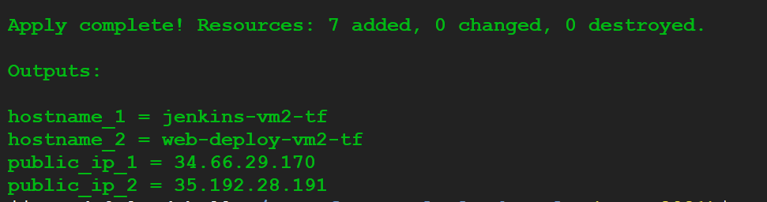
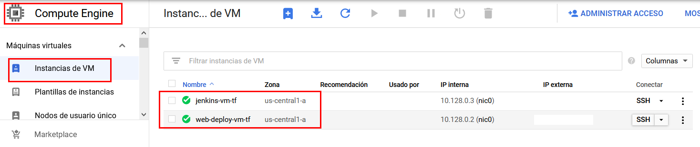
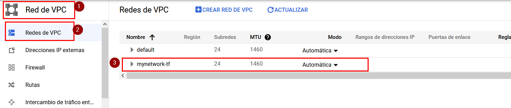
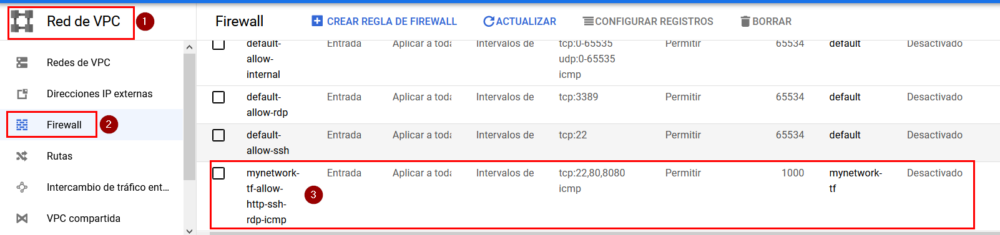
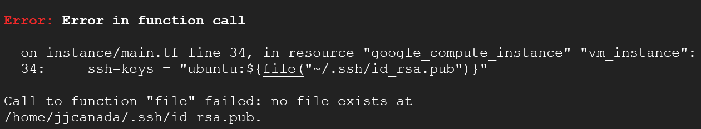

# Basic Example
__Upgraded to Terraform v0.14__

Create network, firewall rule and two virtual machines using a module definition.
Based on lab titled Automating the Deployment of Networks with Terraform on QwikLabs.com

## VM 1 - Docker ready
Used for deployment Jenkins on Docker

## VM 2 - Docker ready, Docker compose, JDK 8 and NodeJS 12.
Used for web apps deployment 

## Resulting infrastructure on GCP

The command `terraform apply` finished correctly:

2 Virtual machine instances: 

1 network 

1 firewall rule

## Troubleshooting

If some errors appear during the `terraform apply` process, please read the error messages and try to solve them. For example:

If the `terraform apply` command does hangs up and does not finish, please, check your infrastructure in GCP console, and manually **remove the elements** shown in previous screenshots, if any of them were created in a previous execution and they are still there.

## More templates

https://registry.terraform.io/browse/modules?provider=google&verified=true

